姓名：谢耀霖  
班级：2305班  
学号：U202315569  
日期：2025-9-30

---

# 实验简介

## 一.实验背景
随着云计算与大数据应用的快速普及，“对象存储”（Object Storage）已经成为大规模数据存储系统中的关键组成部分。对象存储相比传统的文件存储或块存储，有更好的扩展性、弹性，以及管理海量非结构化数据（比如图片、日志、备份、媒体文件等）的能力。在许多生产系统中，如 AWS S3、Azure Blob Storage、MinIO 等，对象存储提供高级 API、丰富元数据支持、版本管理、权限控制等功能。

然而，在这些系统中，延迟（Latency） 的表现尤其关键。用户期望读写请求的响应时间低且稳定，但在并发请求高、对象大小不一、网络负载重等情况下，经常出现 尾部延迟（Tail Latency） 的现象——即某些请求响应时间明显高于平均水平。这可能影响系统的可用性、用户体验和整体吞吐率。

在 “大数据存储技术实验”中，一个重要的课题就是理解对象存储系统在不同负载（特别是并发数）下的延迟分布是如何变化的。这包括不仅看平均延迟，更要关注 P50 / P90 / P95 / P99 等分位数（或百分位延迟），因为这些指标能揭示在高并发情况下系统的响应质量和稳定性。
## 二.软件环境
| 软件   | 配置                              |
| ------ | --------------------------------- |
| 操作系统    |Windows 11 家庭中文版  |
| Golang版本   |   go1.25.1 windows/amd64         |
| Server   |   Minio                          |
| Client   |   boto3                         |

## 三.硬件环境
| 硬件   | 配置                              |
| ------ | --------------------------------- |
| CPU    | Intel(R) Core(TM) Ultra 5 225H (1.70 GHz) |
| 内存   | 32.0 GB (31.5 GB 可用)            |
| 硬盘   | 1T SSD                            |

## 四.实验目的
1.熟悉对象存储技术，代表性系统及其特性；  
2.实践对象存储系统，部署实验环境，进行初步测试；  
3.基于对象存储系统，分析性能问题，架设应用实践。  

## 五.主要实验内容

# 实验内容

## 实验1.搭建对象存储
### 1.1 安装本地minio服务端  
采用Docker容器进行安装和配置  
<p align="center">
  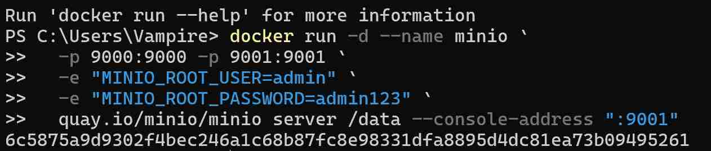
</p>
<p align="center">
  图1 安装Minio
</p>


<p align="center">
  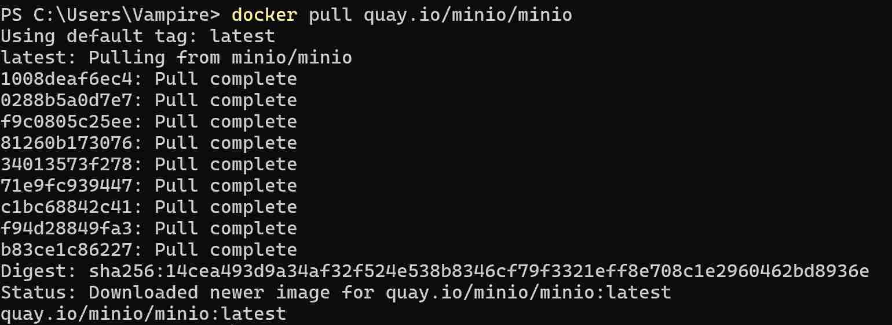
</p>
<p align="center">
  图2 配置Minio
</p>

### 1.2 安装本地的boto3客户端
在pycharm里下载boto3库后连接minio  
```python
s3 = boto3.client(
    "s3",
    endpoint_url="http://127.0.0.1:9000",
    aws_access_key_id="admin",
    aws_secret_access_key="admin123",
    region_name="us-east-1"
)
```
浏览器访问127.0.0.1:9000，输入账号admin，密码admin123后访问正常.
<p align="center">
  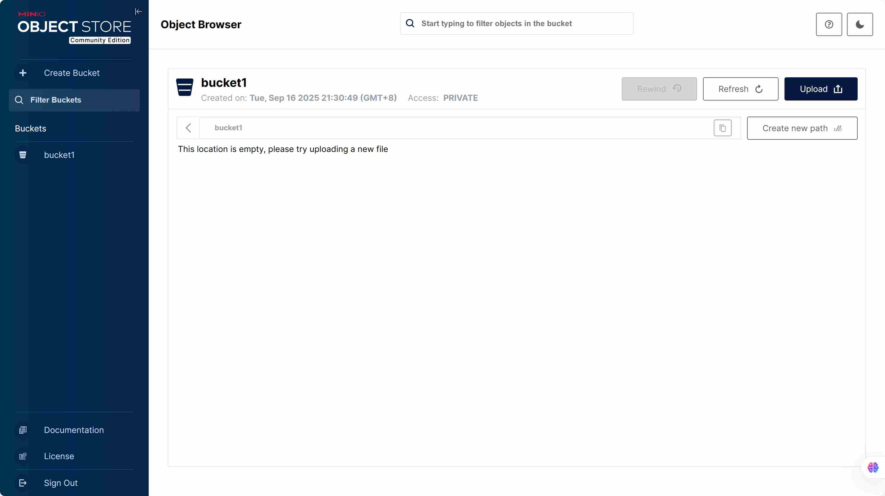
</p>
<p align="center">
  图3 进入Minio
</p>

### 1.3 实践基本功能
做完以上操作之后，使用boto3客户端对服务端做CRUD操作，通过python代码完成，代码见boto3client.py.
<p align="center">
  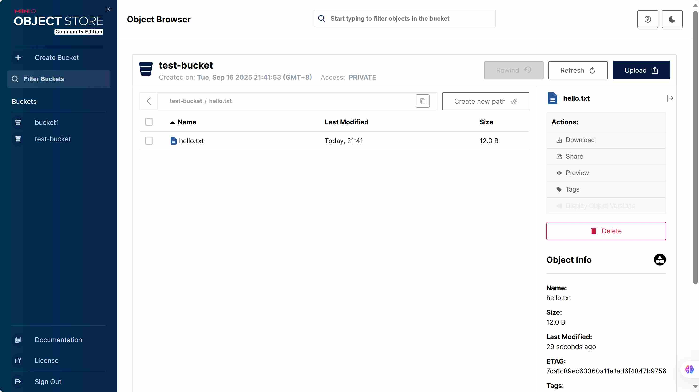
</p>
<p align="center">
  图4 创建库,上传对象并且读取对象的内容(minio界面)
</p>

<p align="center">
  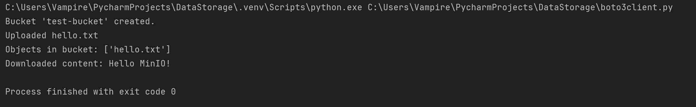
</p>
<p align="center">
  图5 创建库,上传对象并且读取对象的内容(Pycharm界面)
</p>

<p align="center">
  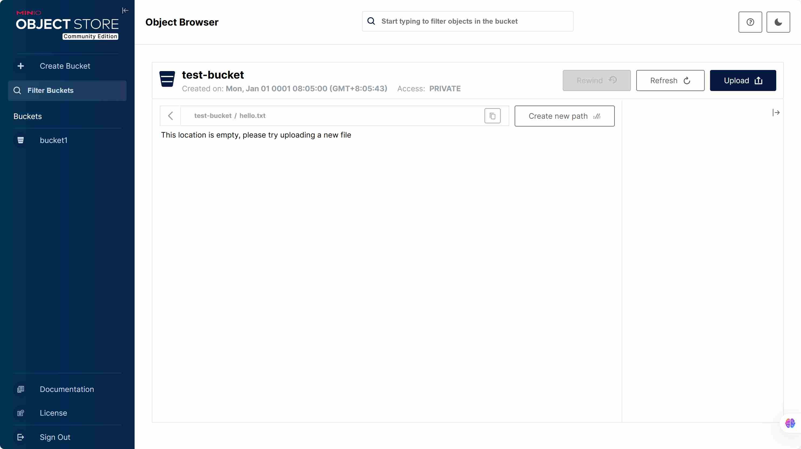
</p>
<p align="center">
  图6 删除对象并删除库(minio界面)
</p>

<p align="center">
  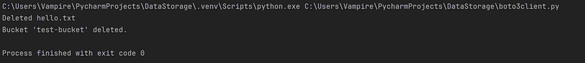
</p>
<p align="center">
  图7 删除对象并删除库(Pycharm界面)
</p>

## 实验2.观测分析性能
下载标准测试环境s3bench,使用之前需要先配置go环境
```
go install github.com/igneous-systems/s3bench@latest
```
### 2.1 请求并发数对延迟和吞吐率的影响
配置好之后在powershell里编写测试脚本(见test1_powershell.txt)，设置的参数如下:  
numClients(并发数) = 1,5,10,20,50,100  
numSamples(请求总数) = 500  
objectSize(对象大小) = 1MB  
测试的结果见s3bench_results1文件夹  
用python绘制关系图如下  
<p align="center"> 
  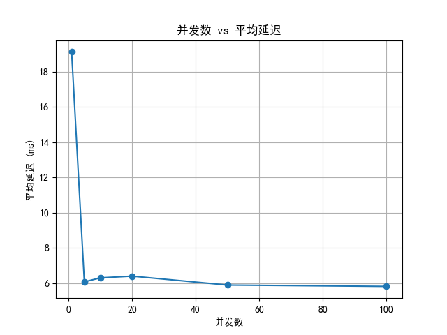 
  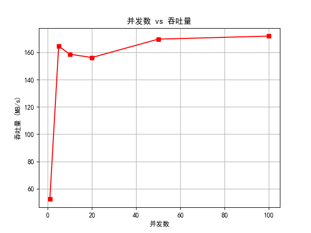 
</p> 
<p align="center"> 
  &emsp;&emsp;图8 并发数和延迟的关系 &emsp;&emsp;&emsp;&emsp;&emsp;&emsp;&emsp;&emsp;&emsp;&emsp;&emsp;&emsp;&emsp;&emsp;&emsp;&emsp; &emsp;&emsp;&emsp;&emsp;&emsp;&emsp;图9 并发数和吞吐率的关系 
</p>

从两张图可以看出对于延迟而言，初始时系统预热，延迟较高，低并发数时系统资源充足，此时延迟较低；随着并发数从0开始上升，延迟先上升后下降；超过临界值，大概50左右时，系统资源被充分利用，延迟趋于平稳.  
对于吞吐率而言，低并发数时硬件和软件资源未被充分利用，并发率极低；随着并发数上升，吞吐率快速升高；当系统资源接近饱和时，吞吐率平缓变化，最终趋于平稳  
为了保障服务质量，应采取以下措施  
1.通过压测确定系统在目标延迟和吞吐率下的最大并发能力，以此为依据规划服务器数量、硬件配置.  
2.根据实时并发量自动扩容或缩容资源，在高并发时保障吞吐率，低并发时节约成本.  
3.当并发数超过系统稳定处理的临界值时，通过限流拒绝部分请求，防止系统过载导致延迟陡增、吞吐率暴跌.  
### 2.2 对象大小对延迟分布和吞吐率的影响
设置参数如下(s3bench测试脚本见test2_powershell.txt):  
numClients(并发数) = 10    
numSamples(请求总数) = 500  
objectSize(对象大小) = 1KB,10KB,100KB,1MB,10MB  
测试的结果见s3bench_results2文件夹  
用python绘制关系图如下  
<p align="center"> 
  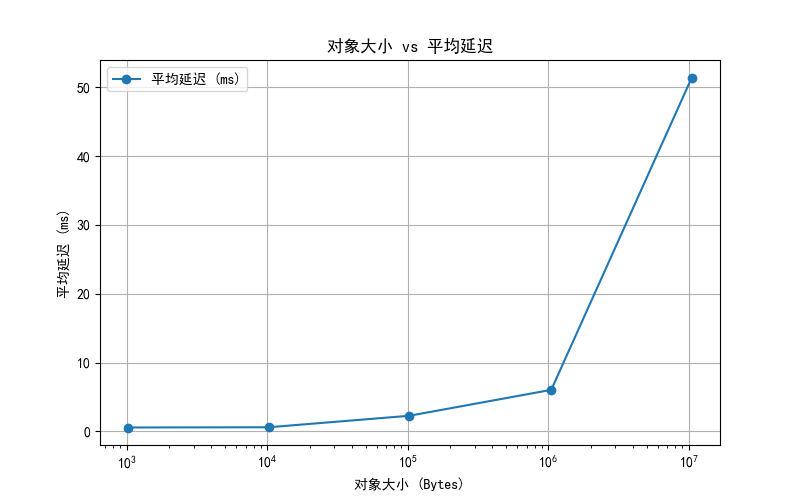 
  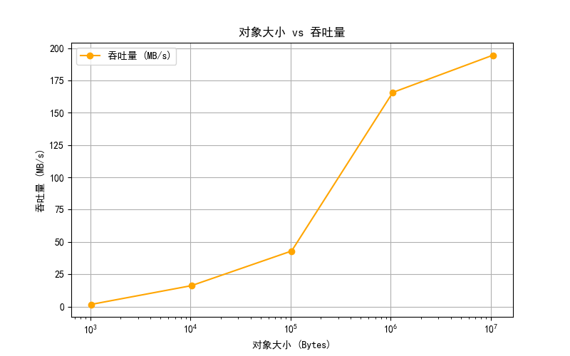 
</p> 
<p align="center"> 
  &emsp;&emsp;图10 对象大小和延迟的关系 &emsp;&emsp;&emsp;&emsp;&emsp;&emsp;&emsp;&emsp;&emsp;&emsp;&emsp;&emsp;&emsp;&emsp;&emsp;&emsp; &emsp;&emsp;&emsp;&emsp;&emsp;&emsp;图11 对象大小和吞吐率的关系 
</p>

对于延迟而言，在对象大小较小时平均延迟处于较低水平且变化不明显，小对象占用的系统资源少，无论是在读取、写入还是传输过程中，所花费的时间都相对较短；随着对象大小增加，平均延迟急剧上升，大对象在存储系统中读写时，需要占用更多的磁盘 I/O 资源.  
对于吞吐率而言，对象大小较小时，吞吐率相对较低，且增长较为缓慢，处理小对象时，系统需要频繁地进行元数据操作，这些操作会带来额外的开销，使得单位时间内处理的数据量有限，限制了吞吐率的提升。随着对象大小的增加，吞吐率显著上升。大对象在一次 I/O 操作或网络传输中能够传输更多的数据，减少了元数据操作的相对占比，从而提高了单位时间内处理的数据量，提升了吞吐率。  
根据不同应用的数据访问特性，合理选择对象存储的配置、策略和功能，可以更好地平衡延迟和吞吐率，满足应用的需求。
  
## 实验3.尝试建模预测
### 预测尾延迟分布
#### 收集数据
对于某一应用(此处假设一个应用，参数手动设置)，参数设置如下：  
```
numSamples = 5000   每次实验请求数  
numClientsList = (1, 5, 10, 20)  并发数列表  
objectSizes = (1024, 10240, 102400, 1048576)  对象大小列表，1KB~1MB  
repeat = 3   每个组合重复实验次数  
```
代码见test3_powershell.txt,数据见s3bench_results_highdata.csv    
#### 分析数据
采用累积分布函数(culmulative distribution function,CDF)进行预测  
```
CDF(x) 表示:延迟 ≤ x 的请求所占比例
```
#### 建模预测
建模代码见predict_model.py,可视化图在images文件夹中，此处选几个预测建模与实际情况吻合的比较好的  
<p align="center"> 
  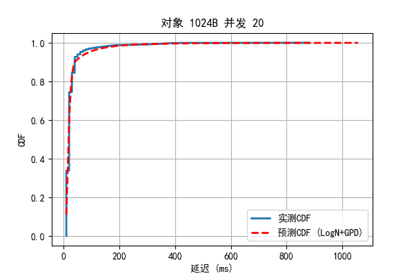 
  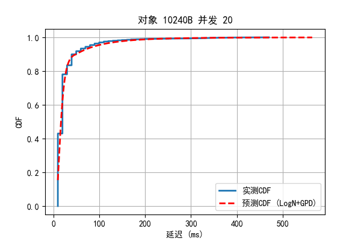 
</p> 
<p align="center"> 
  &emsp;&emsp;图12 对象大小1024B_并发数20&emsp;&emsp;&emsp;&emsp;&emsp;&emsp;&emsp;&emsp;&emsp;&emsp;&emsp;&emsp;&emsp;&emsp;&emsp;&emsp; &emsp;&emsp;&emsp;&emsp;&emsp;&emsp;图13 对象大小10240B_并发数20 
</p>

<p align="center"> 
  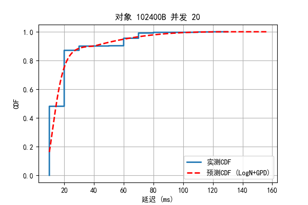 
   
</p> 
<p align="center"> 
  &emsp;&emsp;图14 对象大小102400B_并发数20 &emsp;&emsp;&emsp;&emsp;&emsp;&emsp;&emsp;&emsp;&emsp;&emsp;&emsp;&emsp;&emsp;&emsp;&emsp;&emsp; &emsp;&emsp;&emsp;&emsp;&emsp;&emsp;图15 对象大小1048576B_并发数20 
</p>

可以发现大部分情况都是在并发数为20的时候吻合的比较好，最后的尾延迟预测表见文件尾延迟预测表.csv  
<p align="center">
  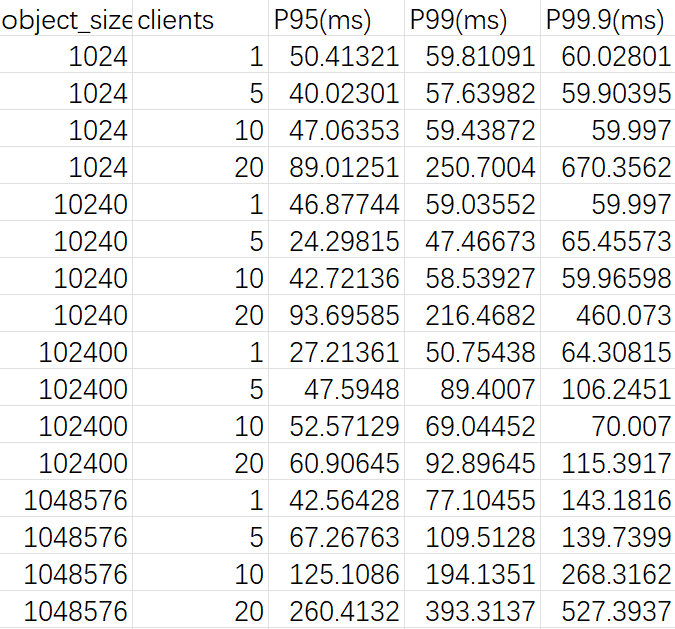
</p>
<p align="center">
  图16 尾延迟预测表
</p>

# 实验小结
通过实验一，我初步接触和了解了对象存储技术的特点，理解了对象存储系统的经典架构，实践了对象存储系统的服务器端和客户端的搭建方法，了解了Python后端以及使用boto3客户端对minio服务端进行操作，熟悉了Docker容器技术。  
通过实验二，我在阅读 s3-bench 等基准测试程序源代码的过程中了解了基准测试程序的设计和编写方法。我对对象存储系统的性能进行了观测，并通过设置不同参数对照实验的方式，探究了对象尺寸和并发数对对象存储系统性能的影响。  
通过实验三，我在查阅文献过程中了解了有关尾延迟的知识，在建模预测过程中，我遇到了不少的问题，大多是选择的预测的模型和实际测试数据误差较大的问题，在不断更换预测模型以及大语言模型的帮助下，我最终选择了CDF，预测模型效果的实现也十分良好。  
本实验中我还可以改进以及进一步探究的的点是可以建立多个桶搭建minio对象存储集群，探索规模化的服务器及其性能。  
# 参考文献
[1] ZHENG Q, CHEN H, WANG Y 等. COSBench: A Benchmark Tool for Clou
 d Object Storage Services[C]//2012 IEEE Fifth International Confer
 ence on Cloud Computing. 2012: 998–999.   
[2] ARNOLD J. OpenStack Swift[M]. O’Reilly Media, 2014.   
[3] WEIL S A, BRANDT S A, MILLER E L 等. Ceph: A Scalable, High-per
 formance Distributed File System[C]//Proceedings of the 7th Sympos
 ium on Operating Systems Design and Implementation. Berkeley, CA, 
USA: USENIX Association, 2006: 307–320.   
[4] Dean J, Barroso L A. Association for Computing Machinery, 2013.
 The Tail at Scale[J]. Commun. ACM, 2013, 56(2): 74–80.   
[5] Delimitrou C, Kozyrakis C. Association for Computing Machinery,
 2018. Amdahl’s Law for Tail Latency[J]. Commun. ACM, 2018, 61(8):
 65–72.  
